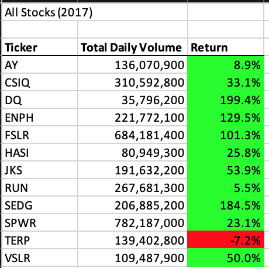
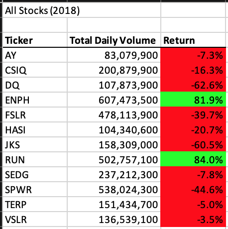
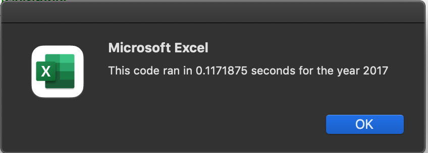
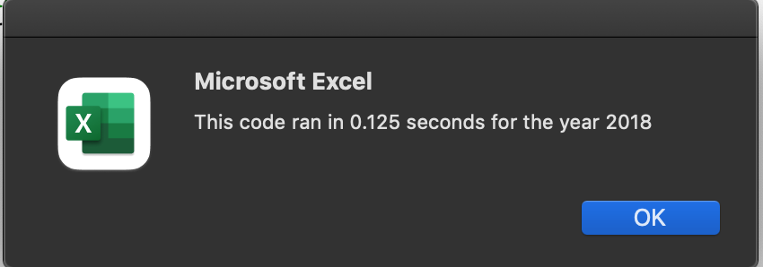

# Stock Portfolio Performance Analysis for 2017-2018

## Project Overview

This analysis was performed to analyze each stock within the portfolio's analysis for 2017 and 2018. After performing this analysis, we are able to see which stocks were the leaders and laggards within the portfolio to make assessments for the future. We automated this process using code in VBA to measure each stock's performance and format the results into an easy-to-read, color-coded table of data. 

## Results

### 2017

In 2017, all but stock ticker "TERP" were up. We can see this due to the formatting code we wrote to highlight all of the stocks with gains in green, and those with losses in red. 

'''

     dataRowStart = 4
      dataRowEnd = 15

     For i = dataRowStart To dataRowEnd
        
          If Cells(i, 3) > 0 Then
            
             Cells(i, 3).Interior.Color = vbGreen
            
          Else
        
             Cells(i, 3).Interior.Color = vbRed
            
         End If
        
      Next i
'''

### 2018

In 2018, almost the opposite occurred. All but 2 stocks, tickers "ENPH" and "RUN" posted losses in 2017. We can easily see this as the same code above ran and displayed their 2018 returns in red. From this analysis, we can infer that the two strongest stocks in the portfolio were tickers "ENPH" and "RUN" as they were the only two to post gains in both years. "ENPH" in particular was the true leader with gains above 80% in both 2017 and 2018.

## Summary

Refactoring in VBA made this process much simpler as we were able to have the same code run for both 2017 and 2018 without having to write the code twice (once for each year/tab of data). By prompting the user to input the year, we can use that input from the input box (code below) to set a variable for the codes to run off of (second code block) by selecting the tab name with that year's data. The main advantages of refactoring as we can see are both time- and space-saving. By writing less code, there are less lines for error that can inpact the analysis and not return what we may want.

'''
    
    yearValue = InputBox("What year would you like to run the analysis on?")
    
'''
'''

    Worksheets(yearValue).Activate
    
'''

The disadvantages of refactoring are in establishing multiple variables that must be done exactly right. With the input box the way it is written right now, it allows for freeform entry so if a year that is not within the report is entered, it will kick errors in all subsequent areas that rely on that year being a tab title to activate that sheet. 

The original script that we wrote was very specific and it is much easier to follow for others to follow. However, it also takes longer to run and as the code gets more complex, or the dataset gets longer, it will take longer to analyze. For example, the image below shows the time it took the refactored code to run (.1172 seconds), whereas the original code took 0.6718 seconds. To further prove this, 2018 took 0.7148 seconds in the original code, compared to the 0.125 seconds for the refactored code (2nd image below).

